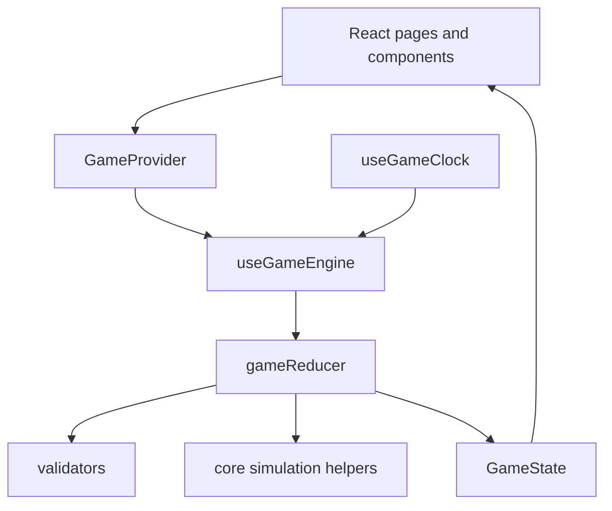

# Smart Stridsledning - Road2Air

Smart Stridsledning is a real-time command-and-control simulation for Swedish
distributed airbase operations. It began as **Road2Air**, a Saab airbase
resource and ATO planning simulator, and has grown into a broader tactical
decision-support prototype with live map operations, multi-unit deployment,
drone and radar behavior, logistics analysis, threat intelligence, plan review,
and a scripted Baltic-incursion demo.

The core idea is simple: an air operation is not only about whether aircraft
exist. It is about whether bases, personnel, fuel, munitions, spare parts,
maintenance capacity, sensors, air defense, drones, roads, dispersal sites,
and commanders can be coordinated fast enough under uncertainty. This project
turns that operational problem into an interactive simulation.

## What This Project Is

Smart Stridsledning is a browser-based simulation and decision-support
environment for:

- Planning and executing ATO-driven air missions.
- Managing Swedish airbase resources across a dispersed base network.
- Tracking aircraft readiness, maintenance, repair outcomes, weapons, fuel,
  spare parts, and personnel.
- Deploying and recalling aircraft, drones, radar, air-defense units, ground
  vehicles, naval units, and road bases.
- Building a live tactical picture on a MapLibre map with overlays for
  weather, satellites, radar, tactical zones, threat rings, supply lines,
  unit tracks, and intelligence.
- Testing plans with AI-style review and recommendations before execution.
- Demonstrating a scripted Baltic scenario where hostile naval and air contacts
  emerge, operators receive an AI brief, and friendly fighters intercept.

It is not a production command system and it does not use real operational
military feeds. It is a hackathon prototype and simulation sandbox intended to
show how airbase operations, tactical C2, and resource-constrained decision
support can be connected in one coherent product.

## Why It Matters

Modern air operations depend on distributed resilience. A fighter can only fly
if the base system can prepare it, fuel it, arm it, repair it, recover it, and
move it when the threat changes. The relevant decision is rarely isolated:

- Launching aircraft consumes fuel, munitions, flight hours, pilots, and
  readiness margins.
- A damaged aircraft may create a maintenance bottleneck.
- A forward base may increase tactical reach but reduce sustainment margin.
- A drone or radar can improve situational awareness but may expose position.
- A plan that looks good on the map may fail because the base cannot support it.

Smart Stridsledning models those couplings. The product vision is an operator
workbench where commanders can compare plans, see consequences, test
dispersal strategies, understand resource endurance, and respond faster to
emerging events.

## Vision

The long-term vision is a **live operational planning twin** for distributed
air operations:

1. A common tactical picture that combines bases, aircraft, drones, sensors,
   naval units, threat intelligence, weather, and infrastructure.
2. A resource-aware planning layer that explains whether an ATO can actually
   be supported from the available base network.
3. A decision-support layer that highlights risk, bottlenecks, coverage gaps,
   expected benefit, tradeoffs, and recommended actions.
4. A scenario and training layer where operators can rehearse incidents,
   compare courses of action, and learn why a plan succeeds or fails.
5. An extensible simulation engine where domain experts can add units,
   constraints, tactics, and future scenarios without rewriting the UI.

The project is deliberately built as a front-end simulation so that the
interaction model, map workflows, and core engine can be demonstrated quickly.
The current codebase is a strong foundation for a deeper product with
persistence, collaborative roles, external data feeds, richer scenario editing,
and more formal verification.

## User Walkthrough

### 1. Start the Simulation

When the app opens, the setup screen lets the operator start with the default
scenario or configure initial resources. Role selection is optional and stores
the selected role in local storage when used.

Roles currently represented in the setup flow include:

- Vingchef - wing commander.
- Flygbaskommendant - air base commander.
- FOB-Chef - forward operating base manager.
- Luftvärnscontroller - air-defense controller.
- Stridsledare - fighter controller.
- Underrättelseofficer - intelligence and reconnaissance officer.

The role system is currently a product framing layer. The state model is shared
for all roles through one `GameProvider`.

### 2. Use the Tactical Map as the Main Cockpit

The default route redirects to `/map`. The map is the primary operational
surface. It shows the Swedish theater with airbases, deployed units, road
bases, active drones, radar, naval units, fixed assets, tactical zones,
satellite tracks, weather overlays, and event sidebars.

The map supports:

- Selecting bases, aircraft, drones, satellites, enemy markers, road bases,
  naval units, tactical zones, and fixed assets.
- Flying the camera to selected entities.
- Drawing tactical zones.
- Adding friendly and enemy plan markers.
- Deploying units from bases.
- Viewing travel range, battle-intel summaries, and threat-ring interactions.
- Toggling overlays through the layer manager and map controls.
- Reviewing event history and scenario-triggered events.

### 3. Manage Airbases and Aircraft

The base dashboard route is `/dashboard/:baseId`, for example
`/dashboard/MOB`. It summarizes the selected base and exposes operational
panels for resources, aircraft, maintenance, personnel, mission schedules,
recommendations, and readiness.

The simulation includes three primary active airbases in the initial state:

- `MOB` - Huvudbas MOB, the main operating base.
- `FOB_N` - Sidobas FOB Nord.
- `FOB_S` - Sidobas FOB Syd.

Reserve and road-base concepts are represented through road bases, map
placement, unit transfer, and dispersal-oriented planning workflows.

### 4. Plan and Dispatch ATO Orders

The ATO page at `/ato` handles air tasking orders. ATO orders specify mission
type, timing, aircraft count, launch base, priority, payload, optional aircraft
type, destination data, and assigned aircraft.

Supported mission concepts include:

- `QRA` - quick reaction alert.
- `DCA` - defensive counter-air.
- `RECCE` - reconnaissance.
- `AEW` - airborne early warning.
- `AI_DT` and `AI_ST` - air interdiction variants.
- `ESCORT`.
- `TRANSPORT`.
- `REBASE`.
- `ISR_DRONE`.

Orders can be created, edited, deleted, imported from CSV, assigned, and
dispatched. Dispatching changes aircraft state, moves aircraft into the
deployed-unit model, and creates event-history records.

### 5. Use Plan Mode

Plan mode lets operators build a proposed tactical picture before committing
changes. It supports:

- Friendly and enemy placement tabs.
- Friendly bases, friendly markers, friendly units, enemy bases, enemy
  entities, and road bases.
- Dragging and relocating planned entities.
- Updating base resources as part of a plan.
- Deploy-now workflows from sidebars.
- A plan-review modal with AI-style recommendations before approval.

This mode is central to the product concept: operators should be able to
explore courses of action before they become the live operational state.

### 6. Work With Drones, Radar, and Air Defense

Drones can be managed through the map, drone dashboard, and drone detail pages.
They can be launched with waypoints, recalled, tracked by connection lines, and
shown with range overlays. Fuel and endurance are modeled and low-fuel behavior
can trigger return-to-base logic.

Radar and air-defense units are first-class units. Radar can be emitting or
not emitting. Air-defense units have engagement and detection ranges, missile
stock, deployed or stowed state, target assignment, and static pre-placed
base-defense variants.

### 7. Run the Baltic-Incursion Demo

The current scripted demo is `baltic-incursion`. It is hidden behind a keyboard
shortcut so it does not interfere with normal exploration.

To arm the scenario:

- Press `Shift+Alt+S`, or
- Press `F9`.

The scenario flow:

1. The scenario arms and creates a trigger event.
2. Hostile naval units appear and drift.
3. Clicking the trigger event moves the camera to the scenario area.
4. After a short delay, two unknown air contacts are revealed.
5. Clicking the bogey event opens the AI action-card phase.
6. Accepting the intercept order sends two friendly Gripen fighters.
7. The scenario advances the local clock multiplier during transit so the
   intercept unfolds quickly.
8. Hostile tracks turn or retreat as the scripted state machine reaches its
   later beats.

The scenario demonstrates the intended product loop: detect, brief, decide,
act, and observe consequences.

## Feature Deep Dive

### Real-Time Simulation

The simulation uses a real-time `TICK` action driven by `useGameClock`. The
clock can run at user-visible speeds and can also use a hidden multiplier for
scripted demos.

The root time fields are:

- `day`
- `hour`
- `minute`
- `second`
- `phase`
- `isRunning`
- `gameSpeed`
- `clockMultiplier`

Scenario phases are:

- `FRED`
- `KRIS`
- `KRIG`

The real-time loop updates movement, patrols, fuel drain, mission timing,
maintenance, drone behavior, recommendations, scenario beats, and event logs.

### Aircraft Lifecycle

Aircraft use a nine-state lifecycle:

```text
ready
allocated
in_preparation
awaiting_launch
on_mission
returning
recovering
under_maintenance
unavailable
```

This is more expressive than a simple ready/broken/on-mission model. It allows
the app to represent preparation, launch readiness, airborne operations,
recovery, maintenance, and fault states separately.

Mission-capable display categories are derived from those states:

- `ready`, `allocated`, `in_preparation`, `awaiting_launch` are shown as
  mission-capable for many UI summaries.
- `on_mission`, `returning` are operationally airborne.
- `recovering`, `under_maintenance` are maintenance-related.
- `unavailable` is not mission capable.

### Base Resource Model

Each base contains:

- Units.
- Spare parts.
- Personnel groups.
- Fuel.
- Ammunition.
- Maintenance bays.
- Infrastructure zones.

Spare parts include quantities, max quantities, reserved quantities, lead
times, source type, turnaround, and reuse behavior. Personnel are grouped by
role. Ammunition and fuel are modeled as constrained stocks. Maintenance bays
limit how many aircraft can be worked on at once.

The current base zones include:

- runway
- prep slot
- front maintenance
- rear maintenance
- parking
- fuel zone
- ammo zone
- spare-parts zone
- logistics area

Some zone structures are currently stronger as data scaffolding than as fully
enforced constraints. Maintenance bays and unit storage checks are more active
in the reducer.

### Multi-Unit Model

Aircraft were refactored into first-class `Unit` variants. The live unit model
supports:

- `aircraft`
- `drone`
- `air_defense`
- `ground_vehicle`
- `radar`

Each unit shares common fields such as:

- `id`
- `category`
- `name`
- `affiliation`
- `sidc`
- `health`
- `position`
- `movement`
- `currentBase`
- `lastBase`
- `parentBaseId`
- `pathHistory`
- optional patrol configuration

Specialized unit fields then add aircraft status, drone endurance and
waypoints, air-defense missile stock and ranges, radar emitting state, or
ground-vehicle speed.

The map uses NATO-style symbols through `milsymbol` where appropriate, while
aircraft can also render with Gripen-specific visual assets.

### Movement and Patrols

Movement is represented by:

- `stationary`
- `moving`
- `airborne`

The core movement helpers advance units toward destinations, enforce airborne
invariants, apply per-minute fuel drain, maintain path history, and support
deterministic patrol orbits.

Patrols are modeled as racetrack-style orbits with:

- center position
- radius
- speed in knots
- axis bearing
- clockwise flag
- ellipse aspect ratio

This supports CAP, AEW, naval, and ISR-like behavior without random movement.

### Drone Engine

The drone engine handles:

- Launching drones from base inventory.
- Assigning waypoint routes.
- Moving drones between waypoints.
- Draining fuel over endurance time.
- Auto-recalling low-fuel drones.
- Returning drones to base.
- Landing and routing them into maintenance.
- Updating range and connection-line overlays.

Drones are tied to parent bases and can be visualized with sensor range,
connection line, and live mission state.

### Intelligence and Fog of War

The intel model includes enemy bases, enemy entities, naval units, fixed
assets, stockpile reports, activity reports, and sensor coverage. Friendly
sensor coverage is computed from friendly systems, and hostile units can be
shown as last-known positions when they leave coverage.

Enemy base categories include:

- airfield
- SAM site
- command
- logistics
- radar
- naval base

Enemy entity categories include fighters, transports, helicopters, armored
vehicles, artillery, SAM launchers, and ships.

Threat level and operational status are explicitly modeled so the map and side
panels can communicate uncertainty.

### Tactical Map Layers

The tactical map is built on MapLibre through `react-map-gl/maplibre`. It
supports several visual styles and overlays, including:

- Dark, topographic, satellite, minimal, ocean, terrarium, and railroad tiles.
- Base rings and marker rings.
- Supply lines.
- Tactical zones.
- Fixed military assets.
- Critical infrastructure and protected assets.
- Region and geo-boundary layers.
- Radar coverage and radar pulse layers.
- Air-defense rings.
- Threat rings.
- Wind and cloud layers.
- Satellite orbit and detail panels.
- Drone range and connection overlays.
- Unit path trails.
- Travel range overlays.
- Battle intelligence overlays and tooltips.
- Coordinate HUD.

The map is intentionally the richest part of the application because it is the
closest expression of the Smart Stridsledning vision: a single operational
surface where logistics, readiness, sensors, and tactical movement meet.

### Logistics and Recommendations

The project contains several decision-support paths:

- Contextual recommendations in the game UI.
- Recommendation feed.
- Optimization panel.
- Plan-review modal.
- Enemy analysis panels.
- Logistics analysis page.
- Resource-transfer logistics-order mockup.
- Per-base strategic analysis tab with AI-style recommendations.

Most of these are modeled inside the client as deterministic or mock
decision-support flows. They demonstrate the intended interface and data model
for future integration with real optimization, simulation, or AI services.

### AAR and Event History

Every important operation creates a `GameEvent`. Events include informational,
warning, critical, and success types, plus optional action categories,
resource-impact context, risk levels, unit references, and base references.

The AAR page and event sidebars use this stream as the history of operator
decisions and simulation outcomes.

Event categories include:

- mission dispatch
- maintenance start or pause
- landing received
- outcome applied
- spare part used
- fault marked NMC
- hangar confirmation
- unit deployed, recalled, transferred, relocated, or destroyed
- contact classified
- low fuel

## Technical Architecture

### Stack

| Layer | Technology |
| --- | --- |
| App framework | React 18 + TypeScript |
| Build tool | Vite |
| Routing | React Router 6 |
| State | `useReducer` + React Context |
| Map | MapLibre GL via `react-map-gl/maplibre` |
| Styling | Tailwind CSS + shadcn/ui + Radix |
| Animation | Framer Motion |
| Icons | Lucide React |
| Symbols | `milsymbol` |
| Charts | Recharts |
| Tests | Vitest, Testing Library, Playwright |

### Runtime Shape



Important properties:

- `GameProvider` wraps the application and exposes one shared state instance.
- `useGameEngine` owns the reducer and convenience dispatchers.
- `gameReducer` is the central mutation point.
- Most simulation logic under `src/core` is pure and testable.
- UI components dispatch typed `GameAction` objects instead of mutating local
  copies of the simulation state.
- `initialGameState` seeds bases, units, ATO orders, tactical zones, drones,
  CAP patrols, AEW aircraft, naval units, intel reports, road bases, and
  overlay defaults.

### Routing

Current routes include:

| Route | Purpose |
| --- | --- |
| `/` | Redirects to `/map` |
| `/map` | Main tactical map |
| `/dashboard` | Redirects to `/dashboard/MOB` |
| `/dashboard/:baseId` | Base dashboard |
| `/ato` | ATO planning |
| `/logistics` | Logistics analysis |
| `/aircraft/:tailNumber` | Aircraft detail dashboard |
| `/aar` | After-action/event history |
| `/units/:id` | Generic unit dashboard |
| `/drones` | Drone dashboard |
| `/drone/:droneId` | Drone detail page |

### State Model

`GameState` is the root model. It contains:

- Current time and scenario phase.
- Bases and units stored at bases.
- Deployed units.
- Successful and failed mission counters.
- Event history.
- ATO orders.
- Running and speed flags.
- Recommendations.
- Maintenance tasks.
- Pending landing checks.
- Enemy bases and entities.
- Friendly planning markers and entities.
- Road bases.
- Tactical zones.
- Overlay visibility.
- Naval units.
- Intel reports.
- Scenario runtime state.

This single state tree is what makes it possible for the map, dashboards, ATO,
logistics views, scenario system, and AAR history to stay synchronized.

### Game Actions

All state changes are represented as `GameAction` variants. Major action
families include:

- Time: `TICK`, `ADVANCE_HOUR`, `TOGGLE_PAUSE`, `SET_GAME_SPEED`.
- ATO: create, edit, delete, import, assign, dispatch.
- Aircraft: send mission, apply outcome, landing check, rebase, maintenance.
- Resources: consume spare parts, update base resources.
- Plan mode: add, edit, delete friendly and enemy markers, units, road bases.
- Unit operations: deploy, transfer, recall, relocate, classify, store.
- Sensors and combat systems: set radar emitting, set air-defense state,
  assign target.
- Overlays: add/remove tactical zones, set overlay visibility.
- Drones: launch, recall, update waypoints, update overlays.
- Scenario: arm, disarm, set beat, add/remove/patch scripted entities.

This explicit action model is useful for future replay, audit, multiplayer
synchronization, persistence, and automated scenario testing.

## Scenario System

The `src/scenarios/baltic-incursion` package contains the current scripted
demo. It is intentionally separated from the general reducer logic:

- `useScenario.ts` connects browser events, keyboard arming, map camera
  movement, and dispatch.
- `controller.ts` is a pure scenario state machine that reads `GameState` and
  returns `GameAction[]`.
- `geo.ts` defines spawn positions, speeds, camera targets, and constants.
- `brief.tsx`, `actionCard.tsx`, `sensorPanel.tsx`, and
  `scenarioOverlay.tsx` provide scenario-specific UI.

The scenario runtime state tracks:

- scenario id
- current beat
- timestamps for stages
- trigger event ids
- hostile naval ids
- hostile aircraft ids
- friendly intercept ids
- satellite ETA
- whether the recommended action was chosen

This architecture is a good template for future demos: keep scenario-specific
logic in a scenario package, express outcomes as normal `GameAction` objects,
and let the shared reducer update the rest of the app.

## Project Evolution From Commit History

The commit history shows a rapid progression from UI scaffold to tactical C2
prototype:

1. **Initial scaffold** - Vite, React, shadcn/ui, Tailwind, dependencies, and
   design-system setup.
2. **Saab airbase simulator** - early Road2Air work focused on a single-base
   dashboard, Saab visual identity, aircraft status, and base flow.
3. **Simulation engine** - phase-based turn simulation, central data context,
   ATO logic, maintenance workflows, remaining-life charts, stochastic repair
   concepts, and developer documentation.
4. **Operational polish** - map centering, plane dashboard, pilot data, AAR
   history, rebase flows, resource views, CSV/ATO import, start screen, and
   GitHub Pages deployment fixes.
5. **Realtime conversion** - the simulation moved from a turn-based feel toward
   a real-time clock, speed controls, interpolated movement, and live map
   trails.
6. **Multi-unit expansion** - the model grew from aircraft-only to first-class
   units with aircraft, drones, air defense, ground vehicles, radar, NATO
   symbols, movement helpers, capacity helpers, and unit dashboards.
7. **Tactical map expansion** - terrain/satellite/weather layers, clouds, wind,
   satellites, radar visuals, coordinate HUD, travel range, battle intel,
   threat rings, path trails, road bases, and fixed assets were added.
8. **Plan and deploy workflows** - plan mode, friendly/enemy placement,
   road-base editing, deploy-now sidebars, plan review, unit-to-base linkage,
   and readiness summaries.
9. **Intelligence and logistics** - enemy analysis, border proximity alerts,
   drone analysis, logistics recommendation panels, resource-transfer mockups,
   naval patrols, and fog-of-war style detection.
10. **Scripted demo** - the Baltic-incursion scenario added an AI brief,
    action card, hostile naval and air contacts, fighter intercept flow, and
    scenario-specific overlays.

The result is a project with two visible layers: the original airbase resource
simulation and the newer tactical command map. The most interesting product
direction is the integration between them.

## Development Setup

Install dependencies:

```bash
pnpm install
```

Start the development server:

```bash
pnpm dev
```

Build for production:

```bash
pnpm build
```

Run tests:

```bash
pnpm test
```

Run the linter:

```bash
pnpm lint
```

Preview a production build:

```bash
pnpm preview
```

The app is a Vite SPA. There is no backend service, database, or server-side
runtime required for the current prototype.

## Repository Map

Important locations:

```text
src/App.tsx
  Application providers, routing, lazy-loaded map/logistics pages.

src/context/GameContext.tsx
  Shared GameProvider and useGame hook.

src/hooks/useGameEngine.ts
  Reducer binding and convenience dispatch methods.

src/hooks/useGameClock.ts
  Real-time simulation tick driver.

src/core/engine.ts
  Central reducer and core action handlers.

src/core/units/
  Unit factories, movement, patrol, capacity, SIDC, air-defense helpers.

src/core/drones/
  Drone launch, waypoint, recall, landing, and maintenance behavior.

src/core/intel/
  Sensor visibility and activity-report helpers.

src/data/initialGameState.ts
  Main seeded scenario state for bases, units, ATOs, patrols, drones, zones,
  road bases, intel, naval units, and overlays.

src/data/config/
  Tunable capacities, durations, probabilities, phases, unit types, and specs.

src/pages/Map.tsx
  Main tactical map composition.

src/pages/map/
  Map layers, sidebars, markers, detail panels, range overlays, scenario
  hooks, drawing tools, and map-specific helpers.

src/components/game/
  Dashboard, ATO, maintenance, recommendations, resource, and modal UI.

src/components/map/
  Reusable map symbols and filter panels.

src/components/radar/
  Radar display and controls.

src/scenarios/baltic-incursion/
  Scripted Baltic-incursion demo controller, UI, and geometry.

src/types/
  Core TypeScript types for game state, units, overlays, radar, and setup.

docs/
  Design and expansion references for the multi-unit battle-map work.

DEVELOPER_GUIDE.md
  Older but still useful Road2Air-focused developer guide.
```

## Testing

The project uses Vitest for unit and integration tests. Current test coverage
includes:

- Drone engine behavior.
- Unit movement.
- Patrol behavior.
- SIDC helper behavior.
- Air-defense logic.
- Unit capacity helpers.
- Integration smoke coverage for road bases, drones, air defense, overlay
  visibility, radar-unit placement, and merged tactical features.

Playwright configuration is present for browser-level testing. The current
project is UI-heavy and map-heavy, so future confidence would benefit from more
Playwright coverage around map rendering, scenario execution, plan mode, and
ATO dispatch flows.

## Design Principles in the Codebase

### One Shared Operational State

The app avoids separate per-page simulations. The map, dashboards, ATO page,
logistics view, event history, and scenario system all read and write the same
`GameState`.

### Actions Instead of Ad Hoc Mutations

The reducer/action pattern keeps operational changes auditable. This is
especially important for a future C2 or training product where every decision
should be replayable and explainable.

### Data-Driven Configuration

Many important values live in `src/data/config`: capacities, durations,
probabilities, phases, unit specs, unit types, and scenario settings. This is
the right direction for a domain simulation because subject-matter experts can
tune assumptions without changing reducer structure.

### Tactical Map as Integration Surface

The map is not just visualization. It is the integration surface where sensor
coverage, aircraft state, base resources, planned deployments, live units,
threats, logistics, and scenario events become actionable.

### Simulation Before Backend

The current product deliberately proves the workflow in the browser first.
That makes the prototype easy to run and demo. It also means persistence,
authorization, external feeds, and multi-user collaboration are future work.

## Known Limitations

- There is no backend, database, authentication, persistence, or multiplayer.
- Most AI-style recommendations are local prototype flows, not live calls to
  an operational AI service.
- Tactical data is synthetic and scenario-oriented.
- Some domain details are approximated for demo value rather than validated
  against real doctrine.
- Several capacity concepts exist as data structures but are not enforced as
  deeply as maintenance bays and unit storage.
- The older `DEVELOPER_GUIDE.md` documents the Road2Air airbase simulator in
  detail, but parts of it predate the multi-unit realtime refactor.
- Lockfiles for multiple package managers are present. The most consistent
  documented path is `pnpm`.
- Map behavior depends on browser rendering and network availability for tile
  sources.

## Future Direction

Strong next steps:

- Persist scenario state and event history.
- Add scenario save/load and replay.
- Add a scenario editor for hostile tracks, triggers, injects, and objectives.
- Expand plan comparison with quantitative scoring.
- Enforce more resource constraints, especially base zones and logistics
  transport capacity.
- Add collaborative multi-role sessions.
- Add exportable AAR reports.
- Add richer weather and sensor effects.
- Integrate real optimization services behind the recommendation interface.
- Add external data adapters for simulated feeds.
- Improve Playwright coverage for the map, scenario, and plan workflows.
- Separate demo data from reusable engine configuration.

## Current Status

Smart Stridsledning is a working frontend prototype. It demonstrates the core
interaction loop for distributed airbase command and tactical decision support:

```text
Observe -> Plan -> Review -> Execute -> Track -> Learn -> Replan
```

The most valuable part of the project is not any single page. It is the
connection between the pages: an ATO order affects aircraft, aircraft affect
maintenance and fuel, units affect the tactical map, sensors affect enemy
visibility, scenarios create events, events trigger decisions, and decisions
feed back into the operational state.

That is the foundation of Smart Stridsledning.
