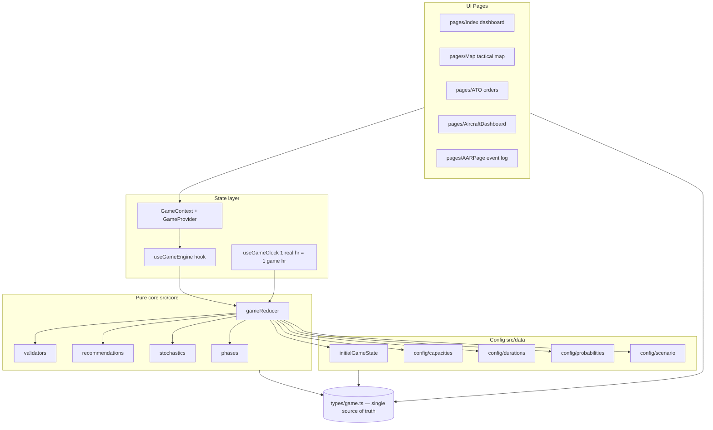
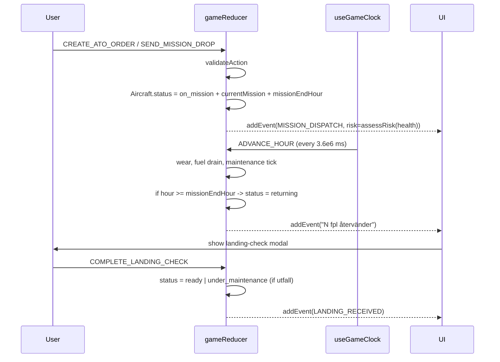

# Multi-Unit Expansion — System Reference

> Reference for agents who will spec out a multi-unit ("palantir-like") extension of
> ROAD2AIR. Today the simulation models **only aircraft**; the goal is to add
> **aircraft, drones, air-defence, ground vehicles, and radar (ground + AWACS)**,
> each a NATO-standard symbol on the map, belonging to a base, with base capacity
> and event logging.
>
> This document captures **what exists today, what can be reused, and what will
> need to be generalised or replaced**. It does not propose the new design — it
> provides the ground truth so the design can be written with accurate
> assumptions.

---

## 1. Repo at a glance

| Item | Value |
| --- | --- |
| Framework | **Vite 5 + React 18 + TypeScript 5.8 SPA** (not Next.js, despite the `pages/` folder name) |
| Routing | `react-router-dom` 6 (`src/App.tsx`) |
| Map | **MapLibre GL** via `react-map-gl/maplibre` (CartoDB dark-matter tiles) |
| State | Single `useReducer` over `GameState`, shared through one `GameContext` |
| Styling | Tailwind 3.4 + shadcn/ui (Radix) + Framer Motion |
| Tests | Vitest + Testing Library + Playwright |
| Path alias | `@/*` → `./src/*` |
| Package manager | both `pnpm-lock.yaml` and `bun.lock`/`bun.lockb` present; README uses `pnpm` |

The engine has **no server, no persistence, no websockets**. "Real-time" = a React
`setInterval` driving `ADVANCE_HOUR` every wall-clock hour via `useGameClock`.
See §4.

Existing long-form docs worth reading first:

- `README.md` — hackathon pitch and feature list.
- `DEVELOPER_GUIDE.md` — ~1000 lines of deep engine walk-through.
- `context.md` — SAAB deck distilled (system boundary, base types, ATO model).

This document is the **multi-unit lens** on top of those, not a replacement.

---

## 2. High-level system map



Key invariant: **everything under `src/core/` is a pure function of
`GameState + GameAction`**. Adding new unit types should preserve that — no
React imports in the core.

---

## 3. The entity model today (all aircraft-centric)

File: `src/types/game.ts` (single source of truth, 287 lines).

```mermaid
classDiagram
  class GameState {
    day: number
    hour: number
    phase: ScenarioPhase (FRED|KRIS|KRIG)
    bases: Base[]
    atoOrders: ATOOrder[]
    events: GameEvent[]
    recommendations: Recommendation[]
    maintenanceTasks: MaintenanceTask[]
    pendingLandingChecks: { aircraftId, baseId }[]
    successfulMissions: number
    failedMissions: number
    isRunning: boolean
  }
  class Base {
    id: BaseType (enum — 6 fixed values)
    name: string
    type: huvudbas | sidobas | reservbas
    aircraft: Aircraft[]
    spareParts: SparePartStock[]
    personnel: PersonnelGroup[]
    fuel: number / maxFuel
    ammunition: {type, qty, max}[]
    maintenanceBays: {total, occupied}
    zones: BaseZone[]
  }
  class Aircraft {
    id: string
    type: AircraftType (enum of 5)
    tailNumber: string
    status: AircraftStatus (9-state)
    currentBase: BaseType
    flightHours, hoursToService, health
    currentMission?: MissionType
    missionEndHour?, rebaseTarget?
    payload?, maintenanceType?, maintenanceTimeRemaining?
    requiredSparePart?
  }
  class ATOOrder {
    id, day, missionType, label
    startHour, endHour, requiredCount
    aircraftType?, payload?
    launchBase, targetBase?, priority
    status (pending|assigned|dispatched|completed)
    assignedAircraft: string[]
    coords?, destinationName?, missionCallsign?, fuelOnArrival?
  }
  class GameEvent {
    id, timestamp (Dag X HH:00 string)
    type: info | warning | critical | success
    message: string
    base?: BaseType
    aircraftId?, actionType?: AARActionType
    riskLevel?, healthAtDecision?
    resourceImpact?, decisionContext?
  }
  GameState "1" *-- "*" Base
  Base "1" *-- "*" Aircraft
  GameState "1" *-- "*" ATOOrder
  GameState "1" *-- "*" GameEvent
```

### Enums that a multi-unit expansion has to generalise

All defined in `src/types/game.ts`:

- `BaseType = "MOB" | "FOB_N" | "FOB_S" | "ROB_N" | "ROB_S" | "ROB_E"` — closed
  set of 6 Swedish airbases. The string-literal union is used across validators,
  engine, map, UI. Adding new base kinds (e.g. a Patriot battery host) must
  either extend this or introduce a parallel entity.
- `AircraftType = "GripenE" | "GripenF_EA" | "GlobalEye" | "VLO_UCAV" | "LOTUS"` —
  5 types; every `Record<AircraftType, …>` config table must be extended in
  lockstep (prep time, recovery time, fuel loading, ammo loading — see §6).
- `AircraftStatus` — 9-state lifecycle. Note: **ground units probably want a
  different lifecycle** (no `returning`, no `recovering`, can be `standing_by`);
  see §7.
- `MissionType = "DCA" | "QRA" | "RECCE" | "AEW" | "AI_DT" | "AI_ST" | "ESCORT" | "TRANSPORT" | "REBASE"` —
  currently all air-missions; ground units may need "DEFEND_SECTOR",
  "PATROL_ROUTE", "SEARCH_RADAR_ON" etc.
- `MaintenanceType`, `FacilityType`, `CapabilityLevel`, `BaseZoneType` —
  already unit-agnostic in spirit but named for aircraft workflows
  (`hjulbyte` = wheel change, `kompositrep` = composite repair).

### Capacity today

Capacity at a base is **implicit**. There is no single `maxAircraft` field.
Effective caps are:

- `base.zones` (`src/types/game.ts` + `src/data/config/capacities.ts`) —
  `parking`, `runway`, `prep_slot`, `front_maintenance`, `rear_maintenance`,
  `fuel_zone`, `ammo_zone`, `spare_parts_zone`, `logistics_area`. Today every
  zone's `currentQueue` is **never populated** — the engine doesn't enforce
  zone load; the BaseDetailPanel reads `currentQueue.length/capacity` but it's
  always `0/N`. `MOVE_AIRCRAFT` is stubbed (`engine.ts:102`, returns state
  unchanged — `// TODO: implement zone-based movement`).
- `base.maintenanceBays = { total, occupied }` — actually enforced (validator
  blocks `START_MAINTENANCE` if full; `handleAdvanceHour` recomputes `occupied`).
- `base.spareParts`, `base.ammunition`, `base.fuel`, `base.personnel` — consumable
  pools used by handlers; enforced by hand in reducers, not by a generic
  constraint system.

For the expansion, zones are the most natural place to hook "max capacity per
item-type" — the scaffolding is there, it just isn't wired up.

### "Most recent base an aircraft was assigned to"

`Aircraft.currentBase: BaseType` always reflects where the aircraft currently
lives. There is **no history** of previous bases — REBASE overwrites
`currentBase` on arrival (`engine.ts:293-309`). The only breadcrumb is the
`REBASE` ATO order generated on `REBASE_AIRCRAFT` (`engine.ts:432-445`) which
keeps `launchBase` + `targetBase`. To satisfy the user's "most recent base it
was assigned to" requirement, a new field is needed (e.g. `homeBase: BaseType`
or `lastBase: BaseType`).

---

## 4. Real-time simulation mechanics

### 4.1 Clock

`src/hooks/useGameClock.ts`:

```ts
const MS_PER_HOUR = 3_600_000; // 1 real hour = 1 game hour
setInterval(() => dispatch({ type: "ADVANCE_HOUR" }), MS_PER_HOUR);
```

The simulation is **discrete-hour, not continuous**. Each tick:

1. Wall-clock hour advances (`6:00` is the daily reset; hours wrap 24→6).
2. Scenario phase recomputed via `getPhaseForDay(day)`.
3. Per-base fuel drain (`FUEL_DRAIN_RATE[phase]`, only if any aircraft is on
   mission at that base). FRED 0.5 / KRIS 1.5 / KRIG 3.0 %/hr.
4. Per-aircraft health wear (random 5-10 for ready/allocated; random 20-30 for
   on-mission); `hoursToService` decremented for any "consumes service hours"
   status.
5. Maintenance timers (`maintenanceTimeRemaining`) tick down; completion
   restores `status=ready, health=100, hoursToService=80`.
6. ATO orders marked `completed` past `endHour`; completing aircraft move into
   `returning` status and a `pendingLandingChecks` entry is created.
7. REBASE transfers finalise (aircraft physically moved to target base).
8. Resource-health events emitted (low fuel, empty spare parts).
9. Every 3 game-hours, recommendations regenerate (`generateRecommendations`).

**Implication for ground units**: the hour tick already handles "per-tick state
evolution"; new unit types can hook the same handler. Aircraft-specific wear
rules (`if status === "on_mission"`) should become type-dispatched.

### 4.2 Mission lifecycle (happy path)



### 4.3 Map-layer "real-time" is independent of the clock

`src/pages/map/AircraftLayer.tsx` runs a **separate 60-fps animation loop**
(`requestAnimationFrame` → `setPhase`). Aircraft positions are derived from
`phase` and `BASE_COORDS[base.id]`:

- **Orbit planes** (`on_mission` non-REBASE): each aircraft is parametrised by
  an index `i` producing a base angle `137.5°·i` (golden-angle to spread
  orbits), orbit radius `0.35–0.65°`, orbit speed `4.32–9.18`. They loop around
  their *launch* base, with 80-point trails dimmed from 0.7→0.
- **REBASE planes**: linear interpolation from `coords` to `destCoords` based on
  `progress = (phase % REBASE_VISUAL_PERIOD) / REBASE_VISUAL_PERIOD`. Heading
  computed with a Mercator scale correction.

This is **cosmetic**, not authoritative. The engine has no concept of
lng/lat for aircraft in flight; it only knows hour-based status. A palantir-
style upgrade that wants real ground tracks or AoI polygons will need a new
`position: { lng, lat }` field on units, or keep the cosmetic derivation and
add metadata (callsign, fuel-on-arrival, ETA) that the layer already partly
supports (`ATOOrder.coords`, `destinationName`, `missionCallsign`).

Ground units (stationary by default) should bypass the orbit generator
entirely — they render at `BASE_COORDS` or at a fixed deployment coord.

### 4.4 Stochastics

`src/core/stochastics.ts` + `src/data/config/probabilities.ts`:

- Two d6 utfall tables (A=startup BIT, B=post-mission reception) mapping roll
  1-6 → fault type, repair time, facility, capability, optional
  `requiredSparePart`. Consumed by `APPLY_UTFALL_OUTCOME` / landing check flow.
- Per-hour failure rates: `YELLOW_FAILURE_RATE=0.05`, `RED_FAILURE_RATE=0.01`
  after `MTBF_GRACE_HOURS=7`. All aircraft-oriented today; generalising to
  "units at readiness" is straightforward.

---

## 5. Event logging (AAR) — what to reuse verbatim

This is **exactly the hook the user asked for**: "Unit events must be logged in
our existing repository."

### 5.1 Shape

```ts
interface GameEvent {
  id: string;
  timestamp: string;       // formatted "Dag 3 14:00"
  type: "info" | "warning" | "critical" | "success";
  message: string;
  base?: BaseType;

  // AAR-specific enrichment
  aircraftId?: string;     // rename / widen to unitId
  actionType?: AARActionType;
  riskLevel?: "low" | "medium" | "high" | "catastrophic";
  healthAtDecision?: number;
  resourceImpact?: string;
  decisionContext?: string;
}

type AARActionType =
  | "MISSION_DISPATCH"
  | "MAINTENANCE_START"
  | "MAINTENANCE_PAUSE"
  | "LANDING_RECEIVED"
  | "UTFALL_APPLIED"
  | "SPARE_PART_USED"
  | "FAULT_NMC"
  | "HANGAR_CONFIRM";
```

Events are stored in `GameState.events`, **newest first, capped at 200** (see
`engine.ts:28`). Every reducer mutation that matters routes through
`addEvent(state, event)` — aim to keep this the single write path.

### 5.2 Consumers

- `src/pages/AARPage.tsx` — filter UI over aircraftId / risk / actionType /
  time-range, feeds an AI-recommendations summariser. **Hard-coded for
  `aircraftId`**; widening to `unitId` needs both field rename and filter label
  updates.
- `src/core/recommendations.ts` — reads `events` indirectly via `GameState`
  for pattern detection.
- `src/components/game/ResourcePanel.tsx` and other dashboards read recent
  events for tickers.

### 5.3 What to extend for new unit types

1. Rename `aircraftId` → `unitId` (or add `unitId` alongside and keep the alias
   for back-compat during migration).
2. Add unit-type-specific `AARActionType` values (`RADAR_ON`, `SAM_ENGAGE`,
   `CONVOY_DEPART`, `UAV_LAUNCH`…).
3. AARPage filter chips (`TYPE_FILTER_MAP`) need new entries.
4. The 200-event cap is fine for a hackathon but **will bite in long
   multi-unit runs** — consider increasing or partitioning per unit-class.

---

## 6. Configuration surface — where to extend

All configuration is centralised under `src/data/config/`:

| File | Drives | Multi-unit impact |
| --- | --- | --- |
| `capacities.ts` | `ZONE_CAPACITIES` (per base type), `PERSONNEL_REQUIREMENTS`, `FACILITY_CAPABILITIES`, `MAINTENANCE_CREW_PER_AIRCRAFT`, `FUEL_DRAIN_RATE` | Needs a per-unit-class variant or a generic `RESOURCE_DRAIN_RATE[unitClass][phase]` |
| `durations.ts` | `PREP_TIME`, `RECOVERY_TIME`, `FUEL_LOADING_TIME`, `AMMO_LOADING_TIME` — all `Record<AircraftType, number>` | **Every entry must be updated when adding a unit type**, or the compiler breaks. Consider making these `Partial<Record<…>>` with defaults, or restructuring around a unit-class discriminator. |
| `probabilities.ts` | Utfall tables A/B, weapon-loss & extra-maintenance arrays, yellow/red failure rates, MTBF grace hours | Today entirely aircraft-assumption (LRU, composite repair). Ground/radar units likely want a separate fault-table (e.g. "transmitter fault", "track-lost glitch"). |
| `scenario.ts` | 7-day scenario with `phase`, `threats`, `policyRestrictions` | Unit-type-agnostic. Reusable as-is. |
| `phases.ts` | Deprecated/legacy 14-phase turn definition (see note below) | Not on the realtime path; ignore for this work. |

**Gotcha — two legacy loops still live side-by-side.** `src/hooks/useGameState.ts`
is the **old turn-based state hook** that predates `useGameEngine` /
`gameReducer`. It uses the 4-state status strings (`"mission_capable"`,
`"not_mission_capable"`, …) and has its own duplicate of the fuel-drain /
maintenance tick. It's still imported somewhere, but the authoritative engine
is `useGameEngine` + `gameReducer`. Recent commits are explicit about the
migration (`"made the project real time based"`, `"Change from turn based to
realtime"`). **For the expansion, build on `gameReducer` and treat
`useGameState.ts` as deprecated.**

---

## 7. Aircraft vs ground-unit behavioural differences

User constraint: *"Aircraft fly (they cannot remain stationary in the air),
while ground troops can stand still."*

Concrete places this shows up today:

- `AircraftLayer` always renders `on_mission` aircraft as orbiting around
  their base. Replacing "orbit" with "stationary at deployment coord" is the
  cleanest branch.
- Fuel drain (`FUEL_DRAIN_RATE`) is applied **per base** only when any
  aircraft at that base is `on_mission`. Ground units don't consume jet-A; they
  may consume diesel, electrical power, or nothing while idle.
- `hoursToService` decrements for any status in `["ready", "allocated",
  "in_preparation", "awaiting_launch", "on_mission", "returning"]`
  (`engine.ts:196-199`). Ground units probably have service intervals driven by
  operating time (radar emitting, vehicle running), not by "ready" time.
- Health wear today: `5-10` while `ready`, `20-30` while `on_mission`
  (`engine.ts:190-195`). For a stationary radar unit, wear should be near-zero
  while idle and elevated while `RADAR_ON`. For ground vehicles, wear should
  scale with distance moved, not hours at readiness.
- 9-state aircraft status is a poor fit for ground units: `awaiting_launch`,
  `returning`, `recovering` have no ground analogue; a SAM battery cares about
  `masked | tracking | engaging | cooling_down | dry` etc. A type-specific
  lifecycle per unit class is probably cleaner than shoehorning everything
  into `AircraftStatus`.

### Suggested categories (from SAAB deck + user requirement)

| Category | Stationary default? | Consumes fuel? | NATO-symbol family |
| --- | --- | --- | --- |
| Aircraft (fixed-wing) | No — must orbit/move | Yes | Air / Fixed-wing |
| Drone / UAV | No (during mission), may park | Yes (usually less) | Air / Unmanned |
| Air-defence (SAM/AAA) | Yes | Low/none idle; radar = electricity | Ground / Equipment / Air defense |
| Ground vehicle | Optional (can stand still) | Yes while moving | Ground / Unit or Equipment |
| Radar (ground) | Yes | Electric only | Ground / Equipment / Sensor |
| AWACS | No — airborne radar, must fly | Yes | Air / Fixed-wing / Sensor |

AWACS already exists as an aircraft type (`GlobalEye` flying `AEW` mission),
so the "AWACS" item is actually just an aircraft + sensor role and doesn't
need a new class — worth flagging to the specer.

---

## 8. Map rendering — palantir upgrade points

`src/pages/Map.tsx` + `src/pages/map/*`:

- `BASE_COORDS` in `map/constants.ts` — real Swedish airfields, 6 entries.
  ROBs (reserve bases) are present in this map but **not in `initialGameState`**
  (which only seeds MOB, FOB_N, FOB_S). Markers render greyed-out when the
  base object is missing.
- `BaseMarker` — gradient circle with MC + on-mission badge counts, dashed
  bottleneck ring, fuel bar. Colour from `statusColor(base)` (ratio of `ready`
  aircraft). Expansion: add per-unit-class count badges.
- `AircraftLayer` — canvas trails + PNG silhouette (`@/assets/gripen-silhouette.png`).
  NATO symbology would mean swapping silhouettes for mil-std-2525 or APP-6 glyphs.
  `milsymbol` npm package (~100 KB) is the standard lib for this; it produces
  SVG from a SIDC code.
- `SupplyLinesLayer` — static `SUPPLY_LINES` edges between bases, coloured by
  combined fuel state. Unit-type-agnostic; reusable.
- The map already has hooks for **selected aircraft follow** (`handlePositionUpdate`
  → `map.easeTo`). Generalise to `onSelectUnit` / `onUnitPositionUpdate` and it
  works for any movable unit.

`public/sample_ato.csv` exists — ATO-import path (`IMPORT_ATO_BATCH`) is the
natural template if the expansion wants CSV-seeded units.

---

## 9. Action space (GameAction discriminated union)

`src/types/game.ts:139-161` — 24 action variants. The shape sets the
extensibility contract.

Aircraft-specific actions that a unit-type generalisation would touch:

- `ASSIGN_AIRCRAFT`, `MOVE_AIRCRAFT`, `START_MAINTENANCE`, `SEND_MISSION_DROP`,
  `APPLY_UTFALL_OUTCOME`, `COMPLETE_LANDING_CHECK`, `HANGAR_DROP_CONFIRM`,
  `PAUSE_MAINTENANCE`, `MARK_FAULT_NMC`, `REBASE_AIRCRAFT`.

All of them carry either `aircraftId` or `aircraftIds`. Cheapest migration is a
pair of new generic action families (`UNIT_*`) that coexist with the existing
ones for aircraft back-compat. Validators live in `src/core/validators.ts` —
one switch case per action, 120 lines total, easy to extend.

---

## 10. File-by-file tour — where the expansion will likely land

Ordered by "most likely to edit":

| File | Role | Expansion work |
| --- | --- | --- |
| `src/types/game.ts` | Single source of truth for all enums and interfaces | Add `Unit`, `UnitType`, `UnitClass`, generalise `Base.aircraft` → polymorphic children, widen `GameEvent.aircraftId`, extend action union |
| `src/core/engine.ts` | 836-line pure reducer | Split `handleAdvanceHour` wear/fuel-drain logic by unit class; add handlers for new actions |
| `src/core/validators.ts` | 124-line validator switch | Add cases for new actions + unit-class eligibility |
| `src/data/initialGameState.ts` | Seed data, `createAircraft`/`createPersonnel`/`createZones` factories | Add factories for each new unit class; adjust capacities |
| `src/data/config/durations.ts` | `Record<AircraftType, number>` tables | Restructure as `Record<UnitType, …>` or split by class |
| `src/data/config/capacities.ts` | Zones + personnel + fuel drain | Add per-class capacity rules, unit-type drain rates |
| `src/data/config/probabilities.ts` | Utfall tables | Add non-aircraft fault tables if desired |
| `src/pages/map/AircraftLayer.tsx` | Orbit + rebase animation | Rename or split into `AirUnitsLayer`/`GroundUnitsLayer`; NATO symbology |
| `src/pages/map/BaseMarker.tsx` | Base badges | Add per-class counters |
| `src/pages/map/BaseDetailPanel.tsx` | Base side-panel | Add per-class list sections; wire up zone capacity UI for real |
| `src/pages/map/AircraftDetailPanel.tsx` | Unit side-panel | Either generalise or add sibling panels per class |
| `src/pages/AARPage.tsx` | Event log UI | Widen filter to `unitId`; add new `ACTION_BADGES` entries |
| `src/hooks/useGameEngine.ts` | Convenience dispatch API | Add `dispatchUnit*` helpers mirroring the new actions |
| `src/components/setup/SetupScreen.tsx` | New-game overrides | Expose per-class counts + inventories |
| `src/hooks/useGameState.ts` | **Deprecated** legacy turn-based hook | Leave alone; do not build on it |

---

## 11. Constraints / gotchas the specer should know

1. **Pure reducer invariant** — `src/core/*` must stay free of React, DOM,
   MapLibre, `Math.random` in the type definitions. `Math.random()` is used
   inside the reducer today (health wear, initial flight hours in
   `initialGameState`). That is technically non-deterministic; if
   reproducibility matters for multi-unit scenarios, thread a seeded RNG.
2. **No server / no multiplayer** — everything is in one browser tab; a page
   refresh blows away state (no localStorage persistence). If the expansion
   requires scenario save/load, `LOAD_STATE` action already exists and rehydrates
   the entire `GameState` — build on that.
3. **`hour` wraps 24→6** (not 0), meaning `missionEndHour` past midnight works
   in absolute hour math within the same day but there's no explicit
   day-qualified `endHour`. The engine cheats by using `>=` comparisons within
   the same day tick. Long missions (multi-day) are not modelled.
4. **`BaseType` is a string-literal union, not an enum** — adding a base means
   updating the type definition, `BASE_COORDS`, `initialGameState`, and any
   `Record<BaseType, …>` lookups.
5. **REBASE overwrites `currentBase`** and loses history. The user explicitly
   asked for "the most recent base it was assigned to" — add a `homeBase`
   field, update it only on assignment, not on transit.
6. **Zones infrastructure is scaffolded but unused** — `MOVE_AIRCRAFT` is a
   `TODO`. If the expansion's "base capacity = amount of equipment it can hold"
   requirement uses zones, that's a feature to build, not to reuse.
7. **Two realtime loops coexist.** The game-hour reducer tick (every 3.6M ms)
   and the map animation loop (every RAF, ~16 ms) are independent. State
   updates in the reducer propagate through React context; the map recomputes
   its orbit via `useMemo([bases, phase, currentHour])`. If the expansion needs
   true positional state (so that "where is unit X right now" is
   authoritative across views), introduce a `position` field in state and let
   the map layer read it instead of deriving it.
8. **Events array cap of 200** is fine for 5 aircraft × 7 days; will be
   insufficient with 30+ units across a campaign. Raise or partition.
9. **NATO symbology** is not currently present anywhere in the repo. There is
   one PNG silhouette (`src/assets/gripen-silhouette.png`) and a public
   `jas_e.png`. Expect to either adopt `milsymbol` (MIT, ~100KB) or author SVGs.

---

## 12. Quick reuse checklist for the new spec

What to **reuse as-is**:

- `GameEvent` shape + `addEvent` write path + AARPage filtering — satisfies the
  "unit events logged in our existing repository" requirement with only a
  field rename (`aircraftId` → `unitId`).
- `useGameClock` and the `ADVANCE_HOUR` tick — works for any time-based unit.
- `validators` pattern (per-action switch returning `{valid, reason}`).
- `recommendations` engine — rules just need new predicates.
- `initialGameState` factory pattern (`createAircraft`, `createPersonnel`) —
  natural to extend with `createSAMBattery`, `createRadarUnit`, etc.
- Phase / scenario timeline (`SCENARIO_DAYS`, `getPhaseForDay`).
- `SupplyLinesLayer`, `BaseMarker` gradient/status logic.
- Map follow-camera behaviour (`handlePositionUpdate`).

What to **generalise**:

- `AircraftType` & `AircraftStatus` → polymorphic `UnitType` + class-specific
  status.
- `Base.aircraft: Aircraft[]` → either `units: Unit[]` tagged by class, or
  class-specific arrays.
- All `Record<AircraftType, …>` config tables in `durations.ts`.
- Fuel drain / health wear rules in `handleAdvanceHour`.
- `AircraftLayer` → split by class (air orbits vs ground stationary vs AWACS
  long-loiter).
- `GameEvent.aircraftId` → `unitId`.

What to **add new**:

- `homeBase` / `lastBase` on unit (user requirement).
- Real enforcement of zone / item capacity (currently stubbed).
- NATO-symbol rendering pipeline (SIDC → SVG).
- Per-class action families in the `GameAction` union.
- Per-class fault tables if ground-unit failures are desired.

---

## 13. Source of the "5 pages" mentioned in the README

Routes declared in `src/App.tsx`:

```
/                 → pages/Index.tsx         (dashboard)
/ato              → pages/ATO.tsx           (ATO editor + Gantt)
/map              → pages/Map.tsx           (tactical map, THIS is the palantir)
/aircraft/:tail   → pages/AircraftDashboard.tsx
/aar              → pages/AARPage.tsx       (event log)
```

All 5 share the same `GameProvider` (`context/GameContext.tsx`), so any state
added to `GameState` is immediately available to every page.

---

*Last updated 2026-04-23 by exploration of `main` at commit `8aaf52f`.
All file paths and line numbers above refer to that commit.*
